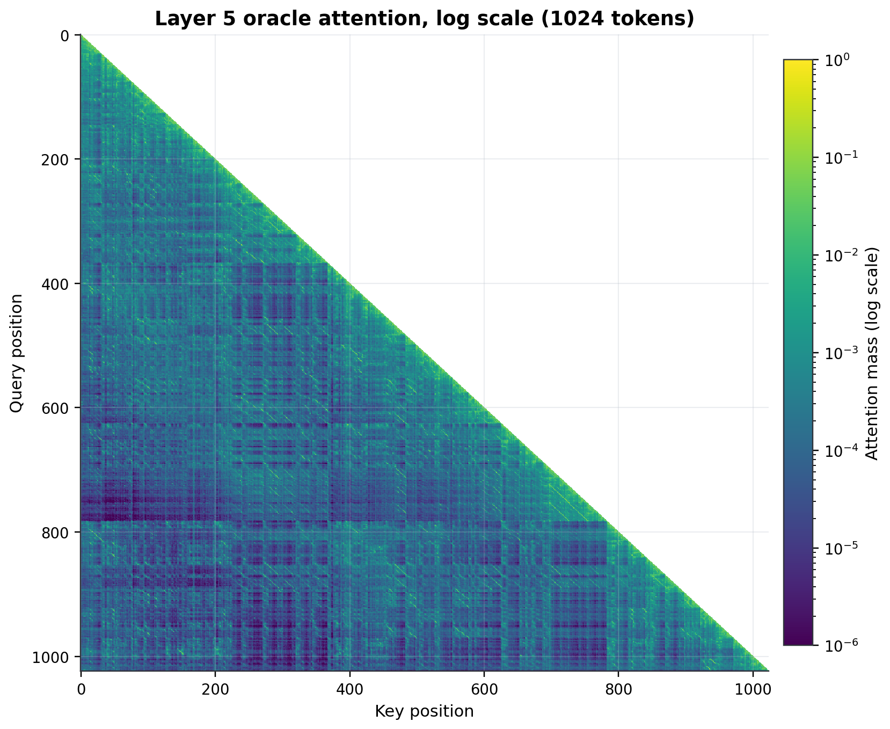
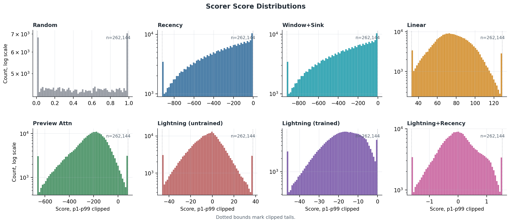
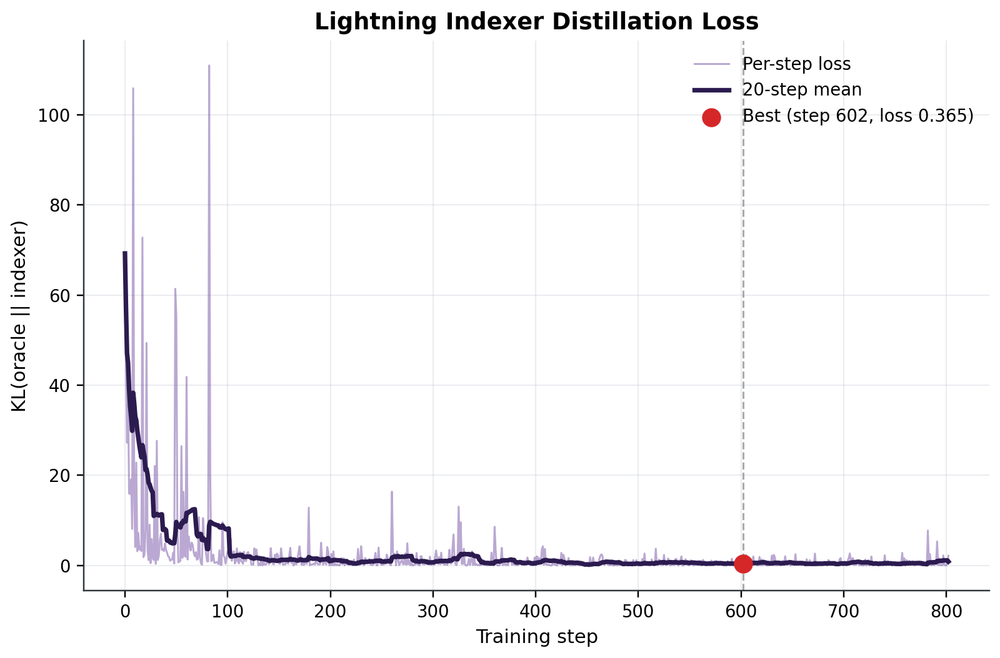
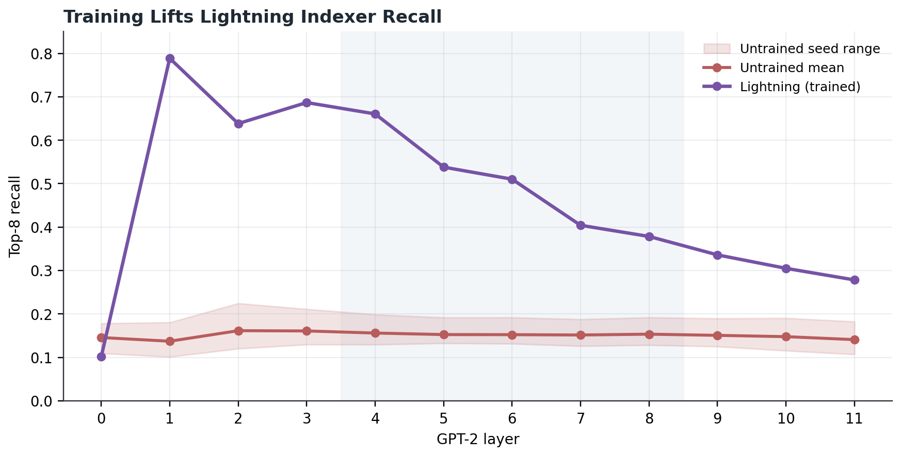
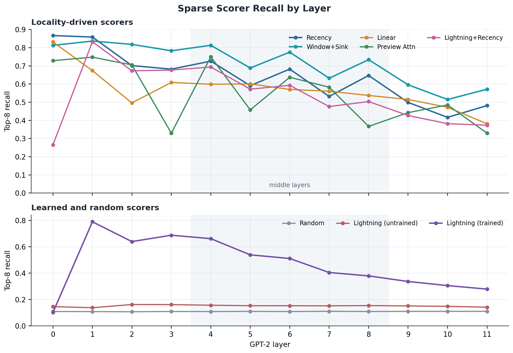
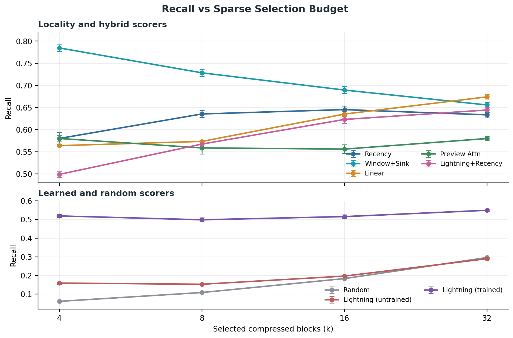
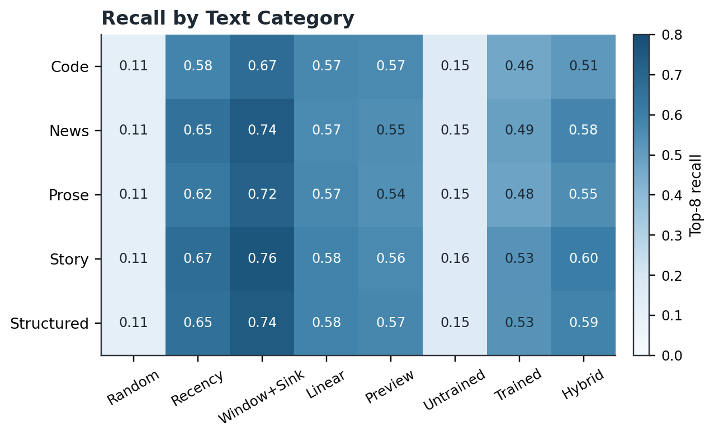
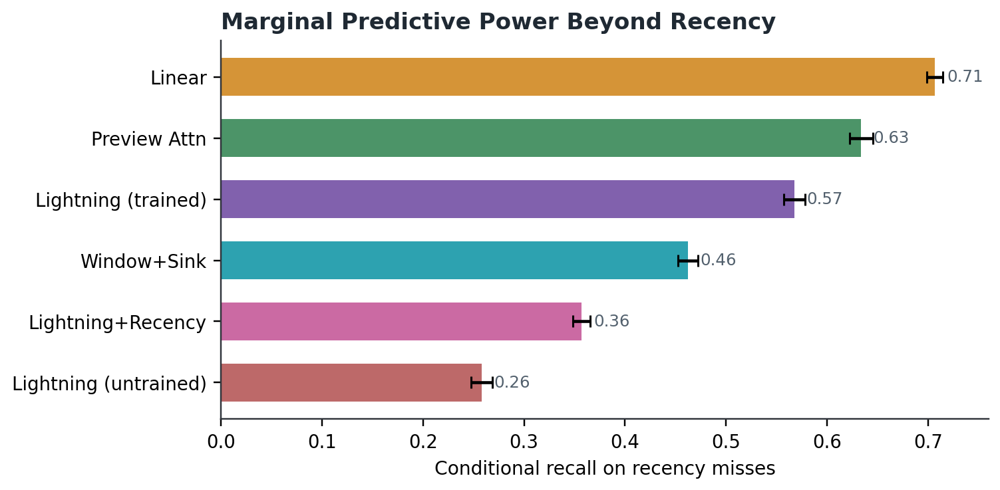
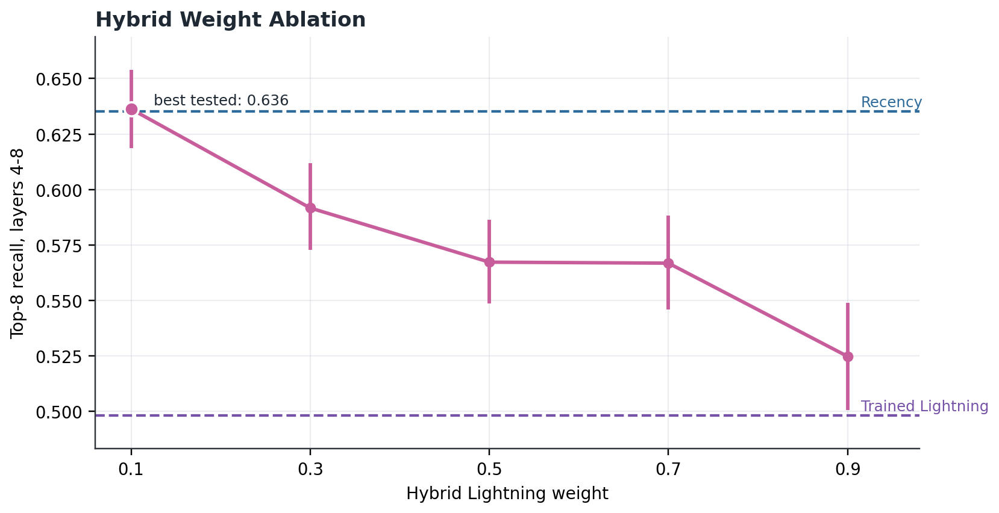

# DSA-Scout: Sparse Attention Routing on GPT-2 Small

> **TL;DR.** Best-checkpoint KL distillation raises Lightning Indexer top-8 middle-layer recall to **0.4983**, versus **0.1531** for five untrained seeds. The scientific result is not that a learned router wins outright: Window+Sink reaches **0.7283**, recency reaches **0.6353**, and the best post-hoc hybrid is `lambda=0.1` at **0.6363**, meaning the learned signal is real but small relative to GPT-2's locality prior.

DSA-Scout is a controlled routing-fidelity measurement. GPT-2 small's own attention is treated as the oracle; candidate sparse scorers are evaluated only on whether they recover the same compressed key blocks.

## Estimand

| Quantity | Value |
|---|---:|
| Backbone | GPT-2 small |
| Eval split | 15 documents, 5 text families |
| Train split | 50 hash-disjoint documents |
| Sequence length | `T = 1024` |
| Compression | `m = 4`, `B = 256` key blocks |
| Headline layers | `L = {4,5,6,7,8}` |
| Sparse budget | `k = 8` |
| Lightning dimensions | `n_heads=8`, `c_I=32`, `d_c=128` |

The corpus loader rejects short or repetitive documents; it never pads by repetition. `results/metadata.json` records source names, content hashes, package versions, corpus diversity, hyperparameters, and split disjointness. `scripts/verify_release.py` recomputes summary means from raw arrays and fails on stale artifacts.

## Oracle Construction

For layer `l`, attention head `h`, query token `q`, and key token `t`, define the head-averaged causal attention:

<p align="center">
  
</p>

Compressed oracle mass is obtained by summing attention over contiguous key blocks:

<p align="center">
  
</p>

Rows are evaluated only when enough causal blocks exist for a nontrivial top-k comparison:

<p align="center">
  
</p>

The metric is set recall between scorer-selected and oracle-selected block indices:

<p align="center">
  
</p>

This heatmap is the first target-validity check. The log normalization exposes diagonal locality and attention-sink structure; without that structure, simple positional baselines would not be competitive.



## Scoring Models

Each scorer returns `S` with shape `[T, B]` under the same causal mask. The non-learned baselines are deliberately explicit:

**Recency**

<p align="center">
  
</p>

**Window+Sink**

<p align="center">
  
</p>

**Linear hidden-state similarity**

<p align="center">
  
</p>

**Preview attention**

<p align="center">
  
</p>

The Lightning Indexer maps GPT-2 hidden states through the learned projections:

<p align="center">
  
</p>

and scores each query/block pair as:

<p align="center">
  
</p>

The hybrid uses per-query standardization before blending, avoiding scale leakage between a learned scorer and a positional scorer:

<p align="center">
  
</p>

<p align="center">
  
</p>

The score-distribution diagnostic checks whether each scorer supplies a real ranking surface. The plot uses p1-p99 clipping and log-count axes because Window+Sink contains a deliberately huge sink bonus.



## Distillation

Lightning is trained on 50 documents times five target layers, giving 250 oracle-hidden pairs. The target distribution sharpens blocked oracle mass with `alpha=32`; the model minimizes masked KL divergence:

<p align="center">
  
</p>

The training loop uses seeded epoch shuffling, 50-step warmup, cosine decay to `1e-5`, gradient clipping at `1.0`, early stopping, and best-rolling-loss checkpoint restoration. This matters scientifically: saving the last checkpoint can report a degraded model while the training curve looks successful.



The untrained sweep controls for architectural luck. The trained curve separates from all five random initializations, so Lightning is learning an oracle-aligned ranking rather than inheriting it from initialization.



## Estimation and Results

Means and confidence intervals are computed from the flattened layer/document measurement vector using a deterministic 5000-resample bootstrap:

<p align="center">
  
</p>

Layer-wise recall is the main estimand. The two-panel layout separates locality-driven scorers from learned/control scorers so the weak baselines do not visually compress the scientific comparison.



The k-sweep tests robustness to sparse budget. The ordering is stable: Window+Sink leads at small budgets, recency is hard to beat, and trained Lightning improves with larger `k` but remains below recency at top-8.



The text-family breakdown checks whether a single corpus type drives the result. The rank ordering is broadly stable across prose, news, code, story, and structured QA.



Conditional recall isolates oracle blocks that recency missed:

<p align="center">
  
</p>

Trained Lightning performs well under this conditional metric, which is the reason to blend it rather than discard it after the top-8 comparison.



Paired deltas are computed on matched layer/document rows:

<p align="center">
  
</p>

The hybrid ablation is the cleanest calibration result. The fixed `lambda=0.5` blend is too heavy on Lightning and trails recency, while `lambda=0.1` reaches **0.6363**, matching recency's **0.6353** within uncertainty and preserving a nonlocal learned term.



## Reproducing

Run `make reproduce` or `python scripts/make.py reproduce` to regenerate the checkpoint, JSON results, plots, and manifest. Before release:

```bash
make lint
make type
make test
make release-check
```

For strict audit mode, run `python scripts/verify_release.py --run-gates --strict-git`.

## Limitations

This is a GPT-2 small, CPU-friendly routing study, not a downstream quality benchmark or a production DSA reproduction. The hybrid weights are post-hoc rather than learned. The conclusion is narrow: best-checkpoint Lightning learns measurable sparse-routing signal, but GPT-2 small's middle-layer attention is still dominated by locality and sink behavior.
